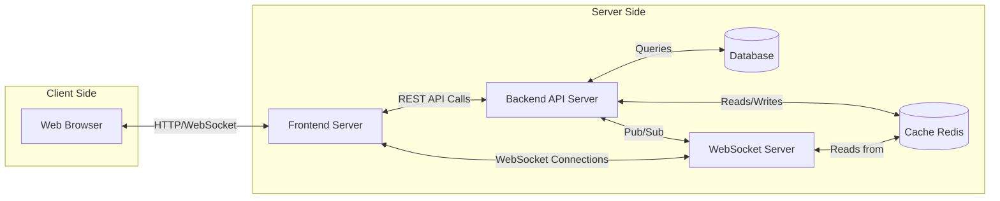
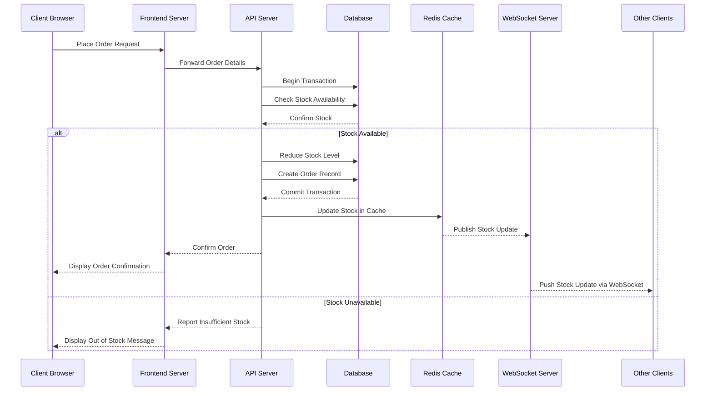
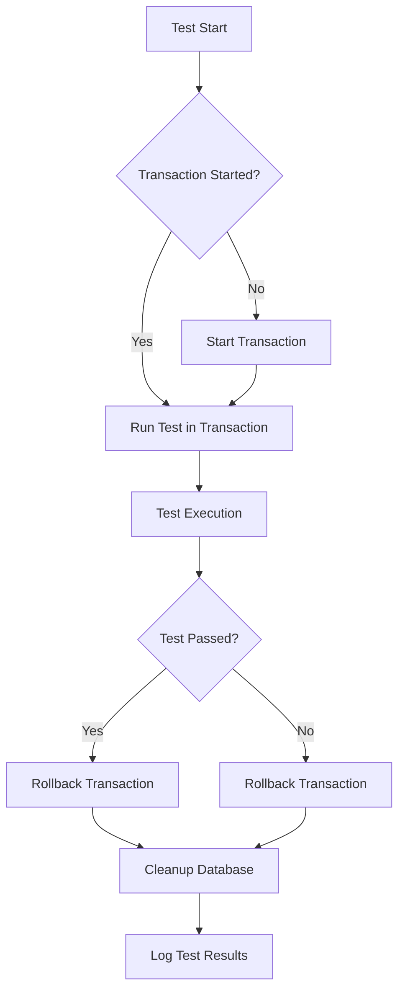
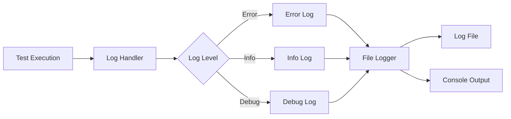
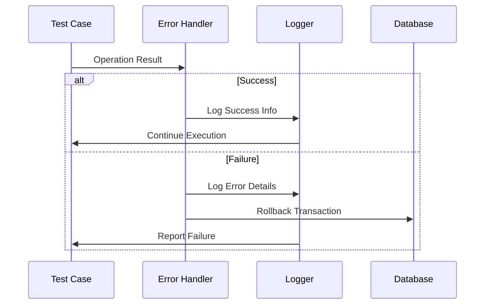

# Rust Market Platform Documentation

## Project Overview
Rust Market is a high-performance, secure, and scalable real-time marketplace platform developed in Rust. The platform emphasizes safety, concurrency, and robust error handling.

## Project Structure
```
rust_market/
├── src/                    # Source code
│ ├── main.rs              # Application entry point
│ ├── lib.rs               # Module declarations
│ ├── db.rs                # Database connection management
│ ├── logging.rs           # Logging configuration
│ ├── models/              # Data models
│ │ ├── mod.rs            # Models module entry
│ │ └── [model files]     # Individual model definitions
│ ├── schema.rs           # Database schema (Diesel generated)
│ ├── handlers/           # API endpoint handlers
│ │ ├── mod.rs           # Handlers module entry
│ │ └── [handler files]  # Individual handler implementations
│ ├── errors.rs          # Custom error definitions
│ └── [other modules]    # Additional functionality
├── tests/                # Test suite
│ ├── models_tests.rs    # Model tests
│ ├── handlers_tests.rs  # Handler tests
│ ├── db_tests.rs        # Database tests
│ ├── performance_tests.rs # Performance tests
│ ├── logging_tests.rs   # Logging tests
│ └── test_helpers.rs   # Test helpers
├── documentation/       # Project documentation
│ ├── core.md           # Core architecture docs
│ └── diagrams/         # System diagrams
├── logs/               # Application logs
└── scripts/            # Utility scripts
```

## Core Components

### 1. Dependencies (Cargo.toml)
Key dependencies and their purposes:
- **actix-web**: Web framework for HTTP server
- **diesel**: PostgreSQL ORM with type-safe queries
- **tokio**: Asynchronous runtime
- **serde**: Serialization/deserialization
- **flexi_logger**: Advanced logging capabilities
- **uuid**: Unique identifier generation
- **bigdecimal**: Precise decimal calculations

### 2. Core Modules

#### Database Management (db.rs)
- Manages PostgreSQL connection pool using r2d2
- Implements connection establishment with proper error handling
- Avoids unwrap() in favor of expect() with meaningful messages

#### Models (models/mod.rs)
Core data structures:
- **User**: Authentication and profile data
- **Product**: Marketplace items
- **Order**: Purchase transactions
- **OrderItem**: Individual items within orders

All models implement:
- Diesel's Queryable and Insertable traits
- Serde's Serialize and Deserialize for JSON compatibility

#### API Handlers (handlers/)
Endpoint implementations:

**Authentication:**
- POST /api/register: User registration
- POST /api/login: User authentication

**Products:**
- GET /api/products: List products
- POST /api/products: Create product (Admin)
- PUT /api/products/{id}: Update product
- DELETE /api/products/{id}: Remove product

**Orders:**
- POST /api/orders: Create order
- GET /api/orders: List user orders
- GET /api/orders/{id}: Order details

### 3. System Architecture



### 4. Order Processing Workflow



## Testing Strategy

### Unit Tests
- **models_tests.rs**: Data model validation
- **handlers_tests.rs**: API endpoint behavior
- **db_tests.rs**: Database operations
- **logging_tests.rs**: Logging system

### Performance Tests
Located in performance_tests.rs:
- Write/read operation timing
- Throughput measurements
- Performance metric logging

## Test Infrastructure

### Database Management


### Test Helpers (test_helpers.rs)
Key Features:
1. **Database Cleanup**
   - Automatic table cleanup in correct dependency order
   - Robust error handling with detailed logging
   - Transaction-based cleanup operations

2. **Test Isolation**
   - Each test runs in its own transaction
   - Automatic rollback after test completion
   - Prevents test interference

3. **Error Handling**
   - Comprehensive error logging
   - Graceful failure handling
   - Detailed error context preservation

4. **Logging Infrastructure**
   - Test-specific log configuration
   - Structured log format
   - Error tracing capabilities

### Test Logging System


### Error Handling Flow


## Monitoring and Debugging

### Logging System
- Configured in logging.rs
- Uses flexi_logger for structured logging
- Logs stored in logs/rust_market_<timestamp>.log

### Log Analysis
Script: scripts/view_logs.sh
- Parses performance metrics
- Formats JSON logs
- Provides quick access to system metrics

## Best Practices Implemented
1. Strong error handling using custom error types
2. Proper database connection pooling
3. Structured logging throughout the application
4. Comprehensive test coverage
5. Clear separation of concerns
6. Transaction-based data operations
7. Real-time updates via WebSocket
8. Cache implementation for performance
9. Secure authentication flow
10. Input validation and sanitization

## Frontend Development Guide

### API Endpoints Reference

#### Authentication Endpoints