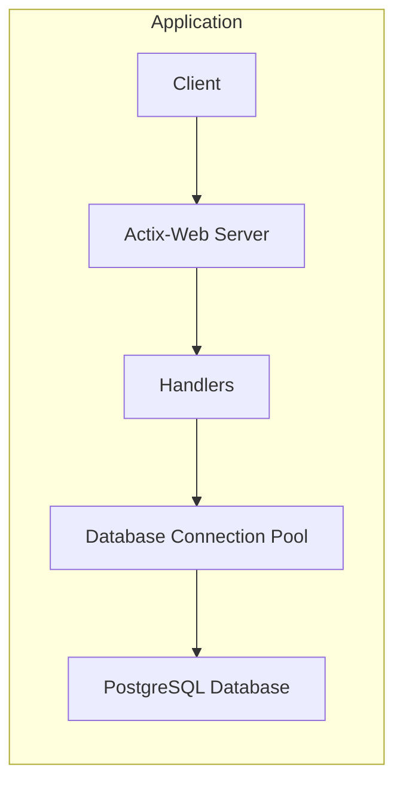
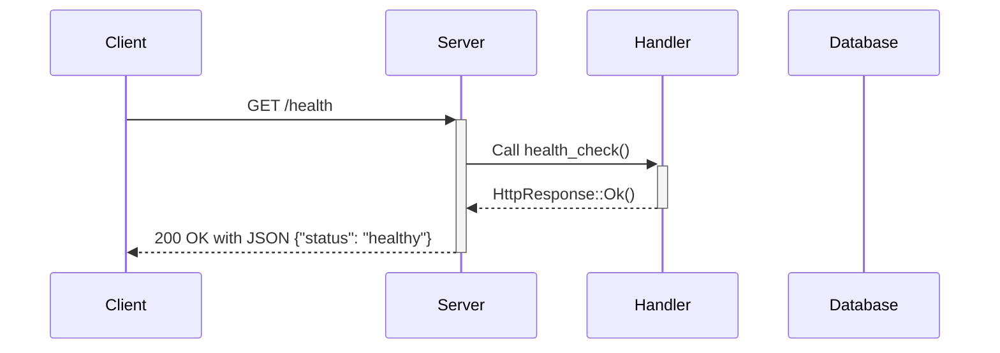
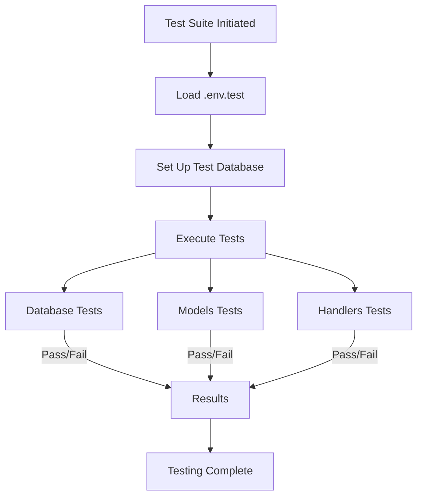

# Current Development Status of `rust_market`

## Overview

As of October 25, 2024, the `rust_market` project has achieved the following milestones:

- **Project Initialization**: Set up the Rust project using `cargo init`, with necessary dependencies included in `Cargo.toml`, such as `actix-web`, `diesel`, `dotenv`, and others.

- **Database Setup**: Configured PostgreSQL as the database, managed through Diesel ORM. Migrations have been created to set up the schema, including tables for `users`, `products`, `orders`, and `order_items`.

- **Models Implementation**: Defined Rust structs in `src/models.rs` corresponding to the database tables. These structs derive necessary traits like `Queryable`, `Insertable`, `Serialize`, and `Deserialize`.

- **Database Connection Pool**: Established a database connection pool in `src/db.rs` using `r2d2` and `diesel`, with proper error handling and environment variable management.

- **Actix-Web Server Configuration**: Set up the Actix-Web server in `src/main.rs` with middleware for logging, and included a health check endpoint.

- **Testing Suite**: Implemented a series of tests to ensure the reliability and correctness of the application components.

## Detailed Components

### Database Schema

The database schema includes the following tables:

- **users**
- **products**
- **orders**
- **order_items**

These tables are defined in the migrations under `migrations/2024-10-25-171428_create_market_tables/`.

### Models

Defined in `src/models.rs`, the models are:

- **User**
- **NewUser**
- **Product**
- **Order**
- **OrderItem**

Each model corresponds to a database table and includes fields matching the table columns, along with appropriate Diesel annotations.

### Database Connection (`src/db.rs`)

- **DbPool Type**: Defined using `r2d2::Pool` and `ConnectionManager` for `PgConnection`.
- **establish_connection_pool Function**: Loads environment variables, retrieves the database URL, creates a connection manager, and builds the connection pool with robust error handling.

### Actix-Web Server (`src/main.rs`)

- **Middleware**: Configured with logging using `flexi_logger` and `ActixLogger`.
- **Routes**: Includes the `health_check` endpoint.
- **Database Pool**: Injected into the application data for handler access.

### Handlers (`src/handlers.rs`)

- **health_check Function**: Responds to GET requests at `/health` with a JSON indicating the server's health status.

### Tests

#### Database Tests (`tests/db_tests.rs`)

- **test_establish_connection_pool_success**: Checks that the connection pool is successfully established using the test database URL.
- **test_establish_connection_pool_missing_env**: Verifies that the connection pool fails to establish when the `DATABASE_URL_TEST` environment variable is missing.

#### Models Tests (`tests/models_tests.rs`)

- **test_create_new_user**: Inserts a new user into the database and asserts that the data matches what was inserted.
- **test_insert_duplicate_user**: Attempts to insert a duplicate user and confirms that a constraint violation error occurs.

#### Handlers Tests (`tests/handlers_tests.rs`)

- **test_health_check**: Sends a GET request to `/health` and asserts that the response is 200 OK with the expected JSON payload.
- **test_health_check_wrong_method**: Sends a POST request to `/health` and expects a 404 Not Found response, ensuring that the endpoint correctly handles unsupported HTTP methods.

## Application Workflow

### High-Level Architecture --------- High-Level Architecture --------- High-Level Architecture

### Health Check Endpoint Workflow --------- Health Check Endpoint Workflow --------- Health Check Endpoint Workflow

### Test Execution Flow ----- Test Execution Flow ----- Test Execution Flow

