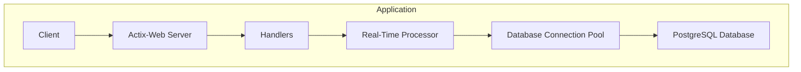
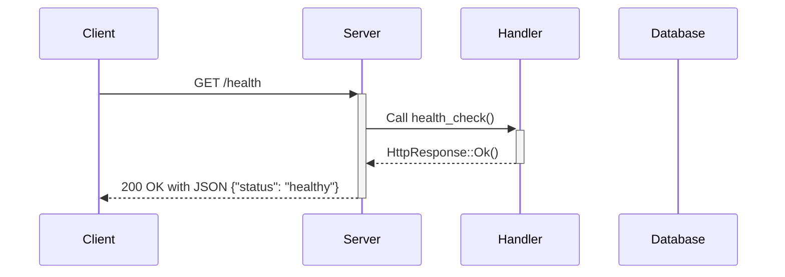
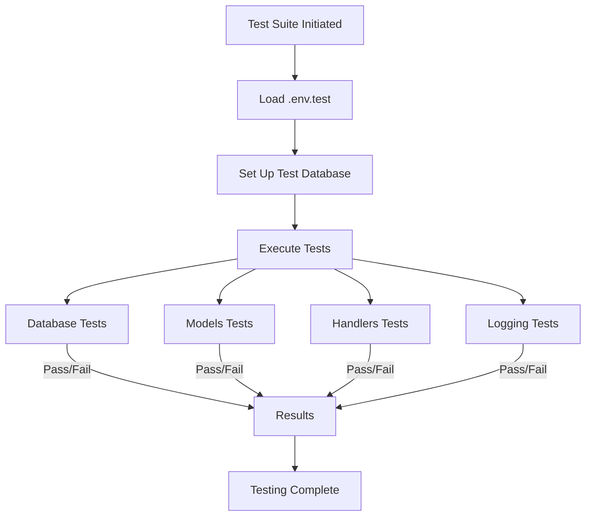

# Current Development Status of `rust_market`

As of October 25, 2024, the `rust_market` project has made significant progress in building a **high-speed, high-security real-time marketplace** platform. This document outlines the current state of the project, including recent updates and the overall architecture.

## Overview

- **Project Initialization**: The Rust project was initialized using `cargo init`, with essential dependencies added to `Cargo.toml`, such as `actix-web`, `diesel`, `dotenv`, `flexi_logger`, and others.

- **Database Setup**: PostgreSQL is configured as the database, managed through Diesel ORM. Migrations have been created to set up the schema, including tables for `users`, `products`, `orders`, and `order_items`.

- **Models Implementation**: Rust structs corresponding to the database tables are defined in `src/models.rs`. These structs derive traits like `Queryable`, `Insertable`, `Serialize`, and `Deserialize`, ensuring compatibility with Web3 standards and facilitating smooth interactions.

- **Database Connection Pool**: A database connection pool is established in `src/db.rs` using `r2d2` and `diesel`, with robust error handling and environment variable management. The application avoids using `unwrap()` and prefers `expect()` with meaningful messages, leveraging `Result` and `Option` types for robust error handling.

- **Custom Logging System**: Implemented a custom logging system in `src/logging.rs` using `flexi_logger`, providing structured and level-based logging. The logger is initialized in `src/main.rs`, ensuring comprehensive logging throughout the application.

- **Actix-Web Server Configuration**: The server is configured in `src/main.rs`, including middleware for logging and a health check endpoint. Concurrency is managed using `tokio` for efficient asynchronous operations.

- **Testing Suite**: Comprehensive tests are implemented to ensure the reliability and correctness of application components. Tests cover models, database connections, handlers, and the logging system.

## Detailed Components

### Database Schema

The database schema includes the following tables:

- **users**
- **products**
- **orders**
- **order_items**

These tables are defined in the migrations under `migrations/2024-10-25-171428_create_market_tables/`.

### Models (`src/models.rs`)

- **User**
- **NewUser**
- **Product**
- **Order**
- **OrderItem**

Each model corresponds to a database table and includes fields matching the table columns, with appropriate Diesel annotations and deriving necessary traits for serialization and deserialization to ensure Web3 compatibility.

### Database Connection (`src/db.rs`)

- **DbPool Type**: Defined using `r2d2::Pool` and `ConnectionManager` for `PgConnection`.
- **establish_connection_pool Function**: Loads environment variables, retrieves the database URL, creates a connection manager, and builds the connection pool with robust error handling.
- **Error Handling**: Utilizes `Result` and `Option` types, avoiding `unwrap()` calls, and provides meaningful error messages with `expect()`.

### Logging System (`src/logging.rs`)

- **Initialization**: The logging system is initialized using `flexi_logger` with configurations for log levels, formats, and output destinations.
- **Usage**: Logs are recorded using the standard `log` macros (`info!`, `debug!`, `error!`, etc.), providing detailed insights during development and production.
- **Logs Organization**: Logs are formatted and stored in a structured manner, aiding in monitoring and debugging.

### Actix-Web Server (`src/main.rs`)

- **Middleware**: Configured with logging using `flexi_logger` and `ActixLogger`.
- **Routes**: Includes the `health_check` endpoint and other API routes for marketplace functionalities.
- **Database Pool**: Injected into the application data for handler access, ensuring efficient database interactions.
- **Concurrency**: Managed using `tokio`, adhering to asynchronous programming practices for high performance.

### Handlers (`src/handlers.rs`)

- **health_check Function**: Responds to GET requests at `/health` with a JSON indicating the server's health status.
- **Marketplace Endpoints**: Includes handlers for user registration, product listings, order processing, with rigorous input validation and error handling.
- **Security Measures**: Implements measures like guarded routes, authentication checks, and input sanitization.

### Testing Suite

Tests are organized within the `tests` directory, covering various aspects of the application:

#### Models Tests (`tests/models_tests.rs`)

- **test_create_new_user**: Tests user creation and validation.
- **test_insert_duplicate_user**: Ensures unique constraints are enforced.
- **test_create_order_with_items**: Tests complex relationships and transactions.
- **test_update_product_stock**: Verifies inventory management.

#### Database Tests (`tests/db_tests.rs`)

- **test_establish_connection_pool_success**: Checks successful connection pool establishment.
- **test_establish_connection_pool_missing_env**: Verifies behavior when environment variables are missing.

#### Handlers Tests (`tests/handlers_tests.rs`)

- **test_health_check**: Tests the health check endpoint.
- **test_unauthorized_access**: Ensures protected endpoints require proper authentication.

#### Logging Tests (`tests/logging_tests.rs`)

- **test_logger_initialization**: Validates the logger initializes without errors.
- **test_logging_levels**: Checks that log messages are recorded at appropriate levels.
- **test_log_output**: Confirms that logs are formatted and outputted correctly.

## Application Workflow

### High-Level Architecture

### Health Check Endpoint Workflow

### Test Execution Flow

## Recent Updates

- **Flexi Logger Integration**: A custom logging system has been integrated using `flexi_logger`, enhancing the application's logging capabilities with structured formatting and level-based outputs.

- **Security Enhancements**: Input validation has been strengthened across the application. Best practices are enforced using `cargo clippy` for linting and security checks.

- **Documentation Updated**: The `README.md`, `README_esp.md`, and `tests.md` guides have been updated to reflect the current state of the project.

## Next Steps

- **Performance Optimization**: Continue optimizing database queries and server responses to enhance performance under load, aiming for ultra-fast processing times.

- **Blockchain Compatibility**: Further develop models and structures compatible with Web3 standards to ensure seamless interactions with blockchain technologies.

- **Future AI Integration**: Plan for potential integration of AI functionalities via APIs, focusing on robust error handling, logging, and rate-limit management while adhering to high-security standards.

- **Concurrency Enhancements**: Utilize `tokio` for improved asynchronous operations, ensuring efficient handling of concurrent requests.

- **Gas Usage Optimization**: For smart contract interactions, optimize gas usage by minimizing storage operations in contracts, adhering to blockchain best practices.

## Conclusion

The `rust_market` project is progressing steadily, with significant advancements in building a **high-performance**, **secure**, and **scalable** real-time marketplace platform. The focus remains on enhancing the application's speed and security, integrating cutting-edge technologies like blockchain, and laying the groundwork for potential future AI integration.
