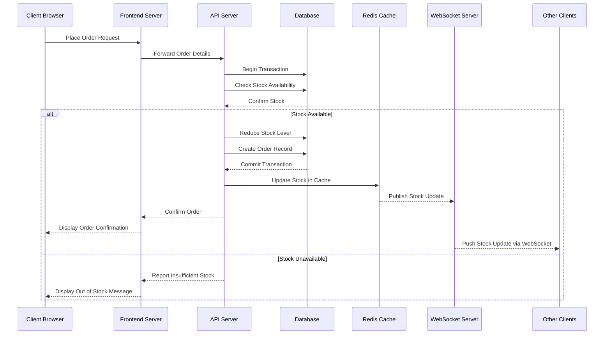

```mermaid
sequenceDiagram
    participant Client as Client Browser
    participant FrontendServer as Frontend Server
    participant APIServer as API Server
    participant Database as Database
    participant Cache as Redis Cache
    participant WebSocketServer as WebSocket Server
    participant OtherClients as Other Clients

    Client->>FrontendServer: Place Order Request
    FrontendServer->>APIServer: Forward Order Details
    APIServer->>Database: Begin Transaction
    APIServer->>Database: Check Stock Availability
    Database-->>APIServer: Confirm Stock
    alt Stock Available
        APIServer->>Database: Reduce Stock Level
        APIServer->>Database: Create Order Record
        Database-->>APIServer: Commit Transaction
        APIServer->>Cache: Update Stock in Cache
        Cache-->>WebSocketServer: Publish Stock Update
        APIServer-->>FrontendServer: Confirm Order
        FrontendServer-->>Client: Display Order Confirmation
        WebSocketServer-->>OtherClients: Push Stock Update via WebSocket
    else Stock Unavailable
        APIServer-->>FrontendServer: Report Insufficient Stock
        FrontendServer-->>Client: Display Out of Stock Message
    end
```
