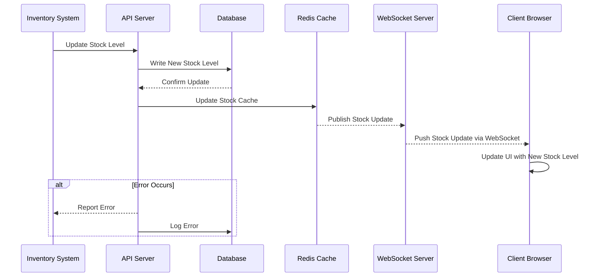

```mermaid
sequenceDiagram
    participant InventorySystem as Inventory System
    participant APIServer as API Server
    participant Database as Database
    participant Cache as Redis Cache
    participant WebSocketServer as WebSocket Server
    participant Client as Client Browser

    InventorySystem->>APIServer: Update Stock Level
    APIServer->>Database: Write New Stock Level
    Database-->>APIServer: Confirm Update
    APIServer->>Cache: Update Stock Cache
    Cache-->>WebSocketServer: Publish Stock Update
    WebSocketServer-->>Client: Push Stock Update via WebSocket
    Client->>Client: Update UI with New Stock Level
    
    alt Error Occurs
        APIServer-->>InventorySystem: Report Error
        APIServer->>Database: Log Error
    end
```
