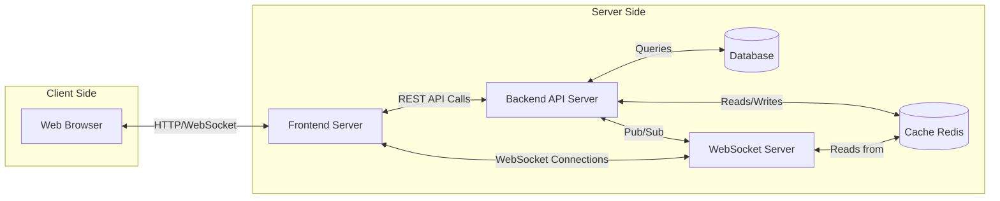

```mermaid  
    flowchart LR
        subgraph "Client Side"
            A[Web Browser]
        end
        subgraph "Server Side"
            B[Frontend Server]
            C[Backend API Server]
            D[WebSocket Server]
            E[(Database)]
            F[(Cache Redis)]
        end
        A <--> |HTTP/WebSocket| B
        B <--> |REST API Calls| C
        B <--> |WebSocket Connections| D
        C <--> |Queries| E
        C <--> |Reads/Writes| F
        D <--> |Reads from| F
        C <--> |Pub/Sub| D
```
