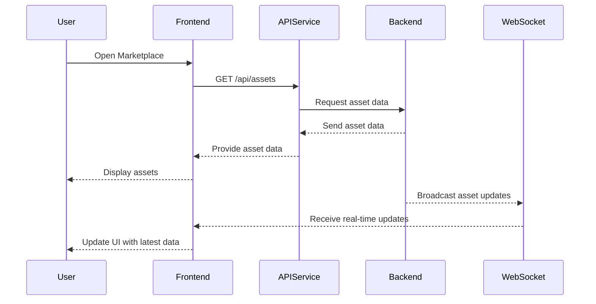
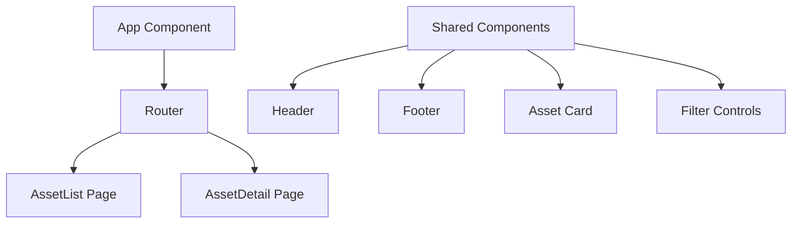

# Frontend Development Plan for Rust Market Platform

## Overview

This document outlines the plan to develop a barebones MVP frontend for the Rust Marketplace platform. The frontend will be a simple, clean, and responsive web application built with React and TypeScript. It will pull data from a PostgreSQL backend via efficient API integrations, allowing users to view, sort, and filter marketplace assets with minimal latency. Real-time updates will ensure the interface always reflects the latest marketplace status.

## Technologies and Tools

- **React** with **TypeScript** for building the user interface
- **Axios** for handling API requests
- **WebSockets** for real-time data communication
- **Prettier** and **ESLint** for code formatting and linting

## Project Structure

```
frontend/
├── src/
│   ├── components/       # Reusable UI components
│   ├── pages/           # Page components for routing
│   ├── services/        # API service modules
│   ├── App.tsx          # Main application component
│   ├── index.tsx        # Entry point
│   └── index.css        # Global styles
├── public/
│   └── index.html       # HTML template
├── package.json
├── tsconfig.json
├── .eslintrc.js
├── .prettierrc
└── README.md
```

## Implementation Plan

### 1. Marketplace Asset Viewing

- **Asset Listing (`GET /api/assets`):**
  - Fetch asset data from the backend
  - Display assets in a user-friendly interface
  - Implement sorting and filtering functionalities

- **Real-Time Updates:**
  - Establish WebSocket connection for real-time asset data
  - Update UI dynamically to reflect latest marketplace status

### 2. Efficient API Integration

- **API Service Modules:**
  - Configure Axios for API requests
  - Set up interceptors for headers and error handling

- **Data Handling:**
  - Implement efficient data retrieval patterns
  - Optimize React component data binding

### 3. User Interface Design

- **Simple and Clean UI:**
  - Minimalist interface focused on essential interactions
  - Intuitive navigation and asset display

- **Responsive Design:**
  - Full responsiveness across devices
  - Mobile-first approach

- **Component Structure:**
  - Modular React components
  - Scalable architecture for future features

### 4. State Management

- **Local State:**
  - React's built-in state management
  - Efficient component state organization

- **Future Scalability:**
  - Structure ready for state management library integration

### 5. Performance Optimization

- **Lazy Loading:**
  - Implement React lazy loading
  - Route-based code splitting

- **Caching:**
  - Basic client-side caching
  - Asset data caching strategy

### 6. Security Best Practices

- **API Security:**
  - Input sanitization
  - Secure API communication
  - Error handling patterns

- **Frontend Protection:**
  - XSS prevention
  - HTTPS enforcement

## Application Flow Diagrams

### Asset Viewing Flow


### Component Architecture


## Development Timeline

1. **Week 1: Setup and Basic UI**
   - Project initialization
   - Basic layout implementation

2. **Week 2: Asset Display**
   - Asset fetching and display
   - Sorting and filtering

3. **Week 3: Real-Time Features**
   - WebSocket integration
   - Real-time UI updates

4. **Week 4: Optimization**
   - Performance optimization
   - Deployment preparation

## Conclusion

This plan outlines the development of a barebones MVP frontend for the Rust Marketplace platform. By focusing on essential features and efficient API integration, we aim to deliver a simple, clean, and responsive application that provides users with real-time access to marketplace assets. The design allows for future expansion while maintaining a focus on performance and user experience.
