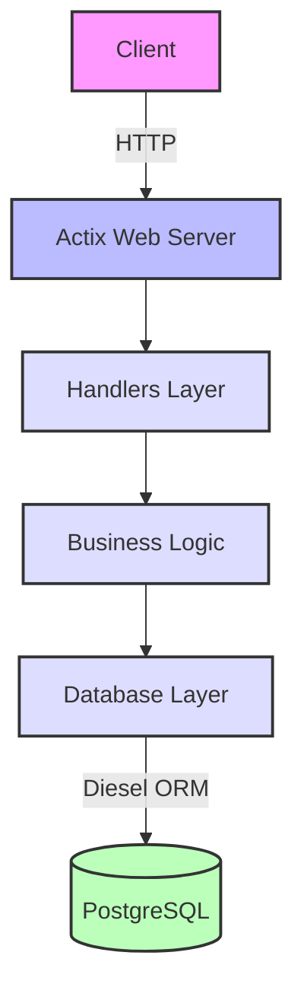
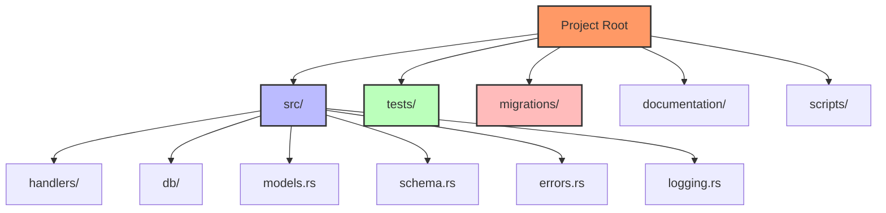
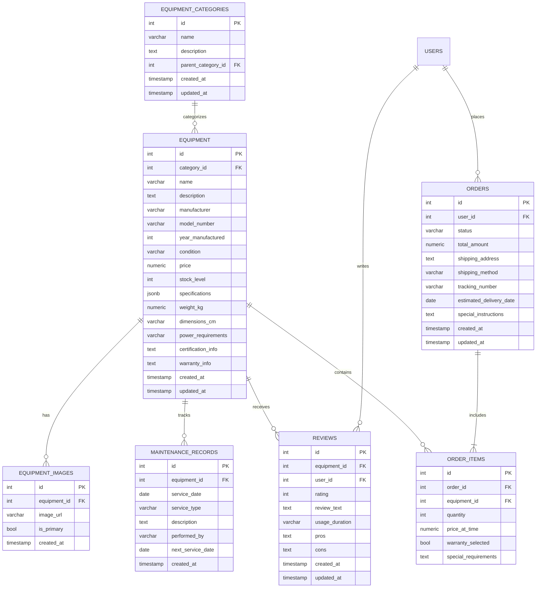
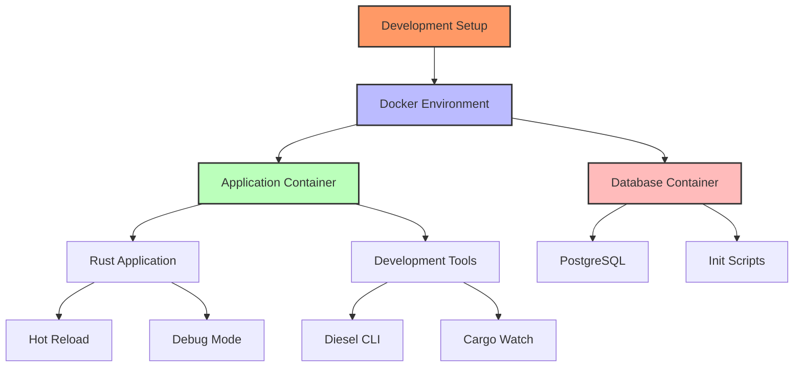
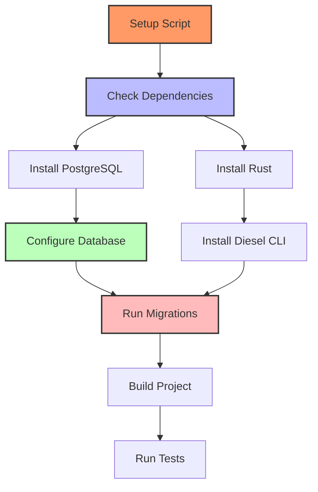
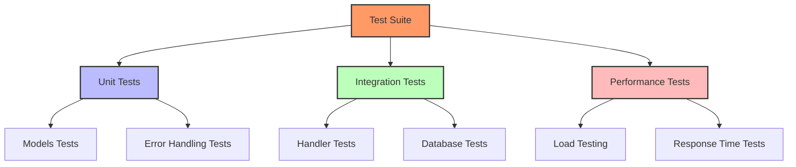

# Rust Market - Technical Documentation

## Project Overview
This document provides a detailed technical overview of the Rust Market project, an industrial equipment marketplace built using Rust and modern web technologies.

## Architecture Overview



## Project Structure



## Core Components

### 1. Database Layer
- Uses Diesel ORM for database operations
- PostgreSQL as the primary database
- Migrations for schema management
- Models defined in `models.rs`
- Schema definitions in `schema.rs`
- Comprehensive equipment and order management tables
- Support for equipment categories and images
- Maintenance records tracking
- Review system implementation

### 2. Web Server
- Actix-web framework
- RESTful API design
- Async request handling
- Error handling middleware
- JSON payload processing
- File upload handling for equipment images

### 3. Logging System
- Comprehensive logging using `flexi_logger`
- Async logging capabilities
- Structured log format
- Log rotation and management
- Custom log formatting
- Environment-specific logging levels

### 4. Error Handling
- Custom error types using `thiserror`
- Consistent error reporting
- Error conversion traits
- HTTP status code mapping
- Detailed error messages for debugging
- Production-safe error responses

## Dependencies
Key dependencies include:
- actix-web 4.4: Web framework
- diesel 2.1.0: ORM and query builder
- tokio 1.32: Async runtime
- serde 1.0: Serialization framework
- chrono 0.4: DateTime handling
- uuid 1.4: Unique identifier generation
- flexi_logger: Advanced logging capabilities
- bigdecimal: Precise numerical calculations
- jsonb: JSON data type support

## Database Schema



## Security Considerations
- Password hashing
- Environment variable management
- Database connection pooling
- Input validation
- Error message sanitization
- SQL injection prevention via Diesel ORM
- File upload validation
- Rate limiting implementation
- CORS configuration

## Deployment
- Docker container support
- Environment configuration
- Database migrations
- Logging setup
- Health checks
- Load balancing readiness
- Database backup strategies
- Zero-downtime deployment support

## Performance Optimizations
- Connection pooling
- Async I/O
- Efficient database queries
- Resource management
- Image optimization
- Database indexing
- Query caching strategies
- Bulk operation support

## Monitoring and Logging
- Structured logging
- Error tracking
- Performance metrics
- Audit trails
- Database query monitoring
- Resource usage tracking
- API endpoint metrics
- User activity logging

## Development Environment



### Docker Configuration
1. **Application Container**
   - Rust development environment
   - Source code mounted for live development
   - Hot reload using cargo-watch
   - Diesel CLI for database management
   - Debug logging enabled
   - Backtrace support

2. **Database Container**
   - PostgreSQL 15
   - Multiple database support (development and test)
   - Persistent volume storage
   - Health check implementation
   - Initialization scripts
   - Exposed on port 5432

### Development Tools
- Cargo Watch: Live code reloading
- Diesel CLI: Database migrations and schema management
- Environment-specific configurations
- Debug logging and backtrace support
- Database initialization scripts
- Development-specific volumes

### Environment Variables
- `DATABASE_URL`: Main database connection
- `DATABASE_URL_TEST`: Test database connection
- `RUST_LOG`: Logging level configuration
- `RUST_BACKTRACE`: Error tracing support
- Database credentials and configuration
- Service ports and networking

### Development Workflow
1. Docker Compose startup
2. Database initialization
3. Migration execution
4. Live code reloading
5. Debug logging
6. Database management

### Best Practices
- Isolated development environment
- Consistent database state
- Live code updates
- Debug-friendly configuration
- Database migration management
- Environment parity with production

## Installation Process



### Automated Setup Script
The project includes a comprehensive setup script (`scripts/setup_and_test.sh`) that automates the entire installation process:

1. **System Dependencies Check**
   - PostgreSQL installation verification
   - Rust toolchain setup
   - Required command availability check

2. **Database Setup**
   - PostgreSQL service management
   - Database user configuration
   - Database creation and initialization
   - Connection verification

3. **Environment Configuration**
   - Database URLs setup
   - Logging level configuration
   - Backtrace settings
   - Environment file generation

4. **Project Setup**
   - Diesel CLI installation
   - Database migrations
   - Project build
   - Test execution

### Installation Steps
```bash
# 1. Clone the repository
git clone [repository-url]
cd rust_market

# 2. Run the setup script
chmod +x scripts/setup_and_test.sh
./scripts/setup_and_test.sh
```

### Environment Variables
The setup process configures the following environment variables:
- `DATABASE_URL`: PostgreSQL connection string
- `DATABASE_URL_TEST`: Test database connection string
- `RUST_LOG`: Debug logging level
- `RUST_BACKTRACE`: Full backtrace for debugging

### Post-Installation
After successful installation:
1. The service can be run with `cargo run`
2. Tests can be executed with `cargo test`
3. API is accessible at `http://localhost:8080`

### Error Handling
The setup script includes:
- Comprehensive error checking
- Detailed error messages
- Automatic cleanup on failure
- Service verification steps
- Connection testing

### Maintenance
- Database migration management
- Environment configuration updates
- Dependency updates
- Service monitoring
- Log rotation

## Testing Infrastructure



### Test Components
1. **Unit Tests**
   - `models_tests.rs`: Validates data models and their relationships
   - `errors_tests.rs`: Verifies error handling and custom error types
   - Test isolation using mock data

2. **Integration Tests**
   - `handlers_tests.rs`: Tests API endpoints and request handling
   - `db_tests.rs`: Validates database operations and transactions
   - Docker-based test environment
   - Test database setup and teardown

3. **Performance Tests**
   - `performance_tests.rs`: Load testing and response time benchmarks
   - Concurrent request handling
   - Database query optimization validation

### Test Configuration
- `test_config.rs`: Test environment configuration
- Environment-specific test settings
- Mock data generation
- Test database initialization
- Logging configuration for tests

### CI/CD Integration
- Automated test runs on pull requests
- Test coverage reporting
- Performance benchmark tracking
- Integration with GitHub Actions
- Docker-based test environment

### Test Best Practices
- Isolated test environments
- Comprehensive error case coverage
- Performance regression testing
- Mock external dependencies
- Clean test data management
- Descriptive test naming

## Future Considerations
- Caching layer implementation
- Rate limiting
- API versioning
- Horizontal scaling
- Message queue integration
- Full-text search implementation
- Real-time notifications
- Payment gateway integration
- Inventory management automation

---

This documentation is maintained as part of the project's technical specifications. For updates or contributions, please follow the project's contribution guidelines.